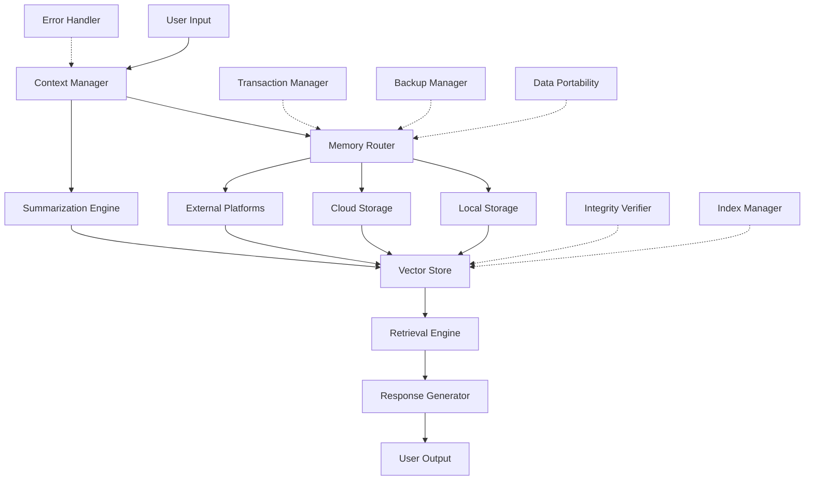

# InfiniteContext

An extensible memory architecture providing virtually unlimited context for AI systems.

## Overview

InfiniteContext is a TypeScript library that provides a structured way to store, organize, and retrieve large amounts of contextual information across different storage tiers. It's designed to solve the context limitation problem for AI systems by creating a robust, hierarchical memory architecture that seamlessly scales from local to cloud storage.

## Key Features

- **Hierarchical Bucket System**: Organize information by domain and topic in a hierarchical structure
- **Tiered Storage Architecture**: Use different storage providers from local disk to cloud services
- **Vector-Based Retrieval**: Efficient semantic search across all stored information
- **Multi-Level Summarization**: Automatic generation of summaries at different levels of abstraction
- **Extensible Storage**: Add custom storage providers to integrate with any system
- **OpenAI Integration**: Ready-to-use integration with OpenAI for embeddings and summarization
- **Robust Error Handling**: Comprehensive error handling with custom error types and recovery mechanisms
- **Data Integrity**: Verification and repair of data integrity to prevent corruption
- **Backup & Recovery**: Automated backup and recovery of stored data
- **Data Portability**: Export and import data in various formats (JSON, JSONL, CSV)
- **Vector Index Optimization**: Automatic optimization of vector indices for performance
- **Transaction Management**: Atomic operations with rollback capability

## Installation

```bash
npm install infinite-context
```

## Basic Usage

```typescript
import { InfiniteContext } from 'infinite-context';
import { OpenAI } from 'openai';

// Create an OpenAI client for embeddings and summarization
const openai = new OpenAI({
  apiKey: process.env.OPENAI_API_KEY
});

// Initialize the system
const context = new InfiniteContext({
  openai,
  embeddingModel: 'text-embedding-3-small'
});

await context.initialize();

// Store content in a bucket
const chunkId = await context.storeContent(
  'InfiniteContext provides virtually unlimited memory for AI systems through distributed storage.',
  {
    bucketName: 'documentation',
    bucketDomain: 'product',
    metadata: {
      source: 'readme',
      tags: ['documentation', 'overview']
    }
  }
);

// Retrieve relevant content
const results = await context.retrieveContent('How does InfiniteContext work?');

for (const { chunk, score } of results) {
  console.log(`Score: ${score.toFixed(3)}`);
  console.log(`Content: ${chunk.content}`);
}

// Generate summaries
const summaries = await context.summarize(longText, { levels: 3 });
```

## Architecture

The system is designed with a modular architecture:



### Core Components

- **MemoryManager**: The main entry point that coordinates all components
- **Bucket**: Organizes chunks into domains and hierarchies
- **VectorStore**: Handles storage and retrieval of embeddings
- **StorageProvider**: Interface for different storage systems
- **SummarizationEngine**: Generates summaries at different levels

### Utility Components

- **ErrorHandler**: Comprehensive error handling with custom error types
- **TransactionManager**: Atomic operations with rollback capability
- **IntegrityVerifier**: Verification and repair of data integrity
- **BackupManager**: Automated backup and recovery of stored data
- **DataPortability**: Export and import data in various formats
- **IndexManager**: Optimization of vector indices for performance

## Storage Providers

InfiniteContext comes with built-in providers:

- **LocalStorageProvider**: Uses the local filesystem
- **GoogleDriveProvider**: Stores data in Google Drive

You can add custom providers by implementing the `StorageProvider` interface.

## Advanced Features

### Google Drive Integration

```typescript
const context = new InfiniteContext({
  openai,
  embeddingModel: 'text-embedding-3-small'
});

await context.initialize({
  addGoogleDrive: true,
  googleDriveCredentials: {
    clientId: process.env.GOOGLE_CLIENT_ID!,
    clientSecret: process.env.GOOGLE_CLIENT_SECRET!,
    redirectUri: 'http://localhost:3000/oauth2callback',
    refreshToken: process.env.GOOGLE_REFRESH_TOKEN!
  }
});
```

### Custom Embedding Function

```typescript
const context = new InfiniteContext({
  basePath: './custom-storage',
  embeddingFunction: async (text) => {
    // Your custom embedding implementation
    // Must return a Vector (number[])
  }
});
```

### Backup and Recovery

```typescript
// Create a backup of all data
const backup = await context.createBackup({
  includeVectorStores: true,
  maxBackups: 5 // Keep only the 5 most recent backups
});

console.log(`Backup created: ${backup.id}`);

// List available backups
const backups = await context.listBackups();
console.log(`Available backups: ${backups.length}`);

// Recover from a backup
const recovered = await context.recoverFromBackup({
  backupId: backups[0].id,
  overwriteExisting: false
});

if (recovered) {
  console.log('Recovery successful');
}
```

### Data Portability

```typescript
// Export chunks to a file
const exportResult = await context.exportChunks(chunks, {
  format: 'json',
  outputPath: './export/data.json',
  compress: true,
  includeEmbeddings: true
});

console.log(`Exported ${exportResult.count} chunks to ${exportResult.path}`);

// Import chunks from a file
const importResult = await context.importChunks({
  inputPath: './export/data.json.gz',
  bucketName: 'imported',
  bucketDomain: 'external',
  decompress: true
});

console.log(`Imported ${importResult.succeeded} chunks`);
```

### Data Integrity

```typescript
// Verify the integrity of a chunk
const verificationResult = await context.verifyChunkIntegrity(chunk, storedHash);

if (verificationResult.isValid) {
  console.log('Chunk is valid');
} else {
  console.log(`Chunk integrity issues: ${verificationResult.errors.length}`);
  
  // Try to repair the chunk
  const repairedChunk = await context.repairChunk(chunk, verificationResult);
  
  if (repairedChunk) {
    console.log('Chunk repaired successfully');
  } else {
    console.log('Chunk could not be repaired');
  }
}
```

### Vector Index Optimization

```typescript
// Get optimal index parameters
const params = await context.getOptimalIndexParams(
  chunks.length,
  chunks[0].embedding.length,
  1024 * 1024 * 1024 // 1GB memory budget
);

console.log(`Optimal index type: ${params.type}`);

// Estimate memory usage
const memoryUsage = await context.estimateIndexMemoryUsage(params, chunks.length);
console.log(`Estimated memory usage: ${memoryUsage / (1024 * 1024)} MB`);

// Optimize an existing index
const optimizedParams = await context.optimizeIndex(chunks, currentParams, {
  targetMemoryUsage: 512 * 1024 * 1024, // 512MB
  maxIndexSize: 1000000
});

// Rebuild the index with optimized parameters
const rebuilt = await context.rebuildIndex(chunks, optimizedParams, './vector-indices/optimized.idx');
```

## License

MIT
