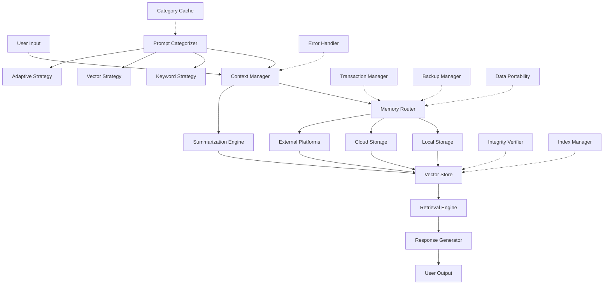

# InfiniteContext

An extensible memory architecture providing virtually unlimited context for AI systems.

## Overview

InfiniteContext is a TypeScript library that provides a structured way to store, organize, and retrieve large amounts of contextual information across different storage tiers. It's designed to solve the context limitation problem for AI systems by creating a robust, hierarchical memory architecture that seamlessly scales from local to cloud storage.

## Key Features

- **Hierarchical Bucket System**: Organize information by domain and topic in a hierarchical structure
- **Automatic Categorization**: Intelligently categorize prompts and outputs into appropriate buckets
- **Tiered Storage Architecture**: Use different storage providers from local disk to cloud services
- **Vector-Based Retrieval**: Efficient semantic search across all stored information
- **Multi-Level Summarization**: Automatic generation of summaries at different levels of abstraction
- **Extensible Storage**: Add custom storage providers to integrate with any system
- **OpenAI Integration**: Ready-to-use integration with OpenAI for embeddings and summarization
- **Robust Error Handling**: Comprehensive error handling with custom error types and recovery mechanisms
- **Data Integrity**: Verification and repair of data integrity to prevent corruption
- **Backup & Recovery**: Automated backup and recovery of stored data
- **Data Portability**: Export and import data in various formats (JSON, JSONL, CSV)
- **Vector Index Optimization**: Automatic optimization of vector indices for performance
- **Transaction Management**: Atomic operations with rollback capability

## Installation

```bash
npm install infinite-context
```

## Basic Usage

```typescript
import { InfiniteContext } from 'infinite-context';
import { OpenAI } from 'openai';

// Create an OpenAI client for embeddings and summarization
const openai = new OpenAI({
  apiKey: process.env.OPENAI_API_KEY
});

// Initialize the system
const context = new InfiniteContext({
  openai,
  embeddingModel: 'text-embedding-3-small'
});

await context.initialize();

// Store content in a bucket
const chunkId = await context.storeContent(
  'InfiniteContext provides virtually unlimited memory for AI systems through distributed storage.',
  {
    bucketName: 'documentation',
    bucketDomain: 'product',
    metadata: {
      source: 'readme',
      tags: ['documentation', 'overview']
    }
  }
);

// Retrieve relevant content
const results = await context.retrieveContent('How does InfiniteContext work?');

for (const { chunk, score } of results) {
  console.log(`Score: ${score.toFixed(3)}`);
  console.log(`Content: ${chunk.content}`);
}

// Generate summaries
const summaries = await context.summarize(longText, { levels: 3 });
```

## Architecture

The system is designed with a modular architecture:



### Core Components

- **MemoryManager**: The main entry point that coordinates all components
- **Bucket**: Organizes chunks into domains and hierarchies
- **VectorStore**: Handles storage and retrieval of embeddings
- **StorageProvider**: Interface for different storage systems
- **SummarizationEngine**: Generates summaries at different levels
- **PromptCategorizer**: Automatically categorizes prompts and outputs into appropriate buckets

### Utility Components

- **ErrorHandler**: Comprehensive error handling with custom error types
- **TransactionManager**: Atomic operations with rollback capability
- **IntegrityVerifier**: Verification and repair of data integrity
- **BackupManager**: Automated backup and recovery of stored data
- **DataPortability**: Export and import data in various formats
- **IndexManager**: Optimization of vector indices for performance

## Storage Providers

InfiniteContext comes with built-in providers:

- **LocalStorageProvider**: Uses the local filesystem
- **GoogleDriveProvider**: Stores data in Google Drive

You can add custom providers by implementing the `StorageProvider` interface.

## Advanced Features

### Google Drive Integration

```typescript
const context = new InfiniteContext({
  openai,
  embeddingModel: 'text-embedding-3-small'
});

await context.initialize({
  addGoogleDrive: true,
  googleDriveCredentials: {
    clientId: process.env.GOOGLE_CLIENT_ID!,
    clientSecret: process.env.GOOGLE_CLIENT_SECRET!,
    redirectUri: 'http://localhost:3000/oauth2callback',
    refreshToken: process.env.GOOGLE_REFRESH_TOKEN!
  }
});
```

### Custom Embedding Function

```typescript
const context = new InfiniteContext({
  basePath: './custom-storage',
  embeddingFunction: async (text) => {
    // Your custom embedding implementation
    // Must return a Vector (number[])
  }
});
```

### Backup and Recovery

```typescript
// Create a backup of all data
const backup = await context.createBackup({
  includeVectorStores: true,
  maxBackups: 5 // Keep only the 5 most recent backups
});

console.log(`Backup created: ${backup.id}`);

// List available backups
const backups = await context.listBackups();
console.log(`Available backups: ${backups.length}`);

// Recover from a backup
const recovered = await context.recoverFromBackup({
  backupId: backups[0].id,
  overwriteExisting: false
});

if (recovered) {
  console.log('Recovery successful');
}
```

### Data Portability

```typescript
// Export chunks to a file
const exportResult = await context.exportChunks(chunks, {
  format: 'json',
  outputPath: './export/data.json',
  compress: true,
  includeEmbeddings: true
});

console.log(`Exported ${exportResult.count} chunks to ${exportResult.path}`);

// Import chunks from a file
const importResult = await context.importChunks({
  inputPath: './export/data.json.gz',
  bucketName: 'imported',
  bucketDomain: 'external',
  decompress: true
});

console.log(`Imported ${importResult.succeeded} chunks`);
```

### Data Integrity

```typescript
// Verify the integrity of a chunk
const verificationResult = await context.verifyChunkIntegrity(chunk, storedHash);

if (verificationResult.isValid) {
  console.log('Chunk is valid');
} else {
  console.log(`Chunk integrity issues: ${verificationResult.errors.length}`);
  
  // Try to repair the chunk
  const repairedChunk = await context.repairChunk(chunk, verificationResult);
  
  if (repairedChunk) {
    console.log('Chunk repaired successfully');
  } else {
    console.log('Chunk could not be repaired');
  }
}
```

### Automatic Categorization

```typescript
// Initialize with categorizer enabled
const context = new InfiniteContext({
  openai,
  categorizerOptions: {
    cacheSize: 1000,
    enableLearning: true
  }
});

await context.initialize({
  initializeCategorizer: true
});

// Store a prompt and output with automatic categorization
const prompt = 'Explain how JavaScript promises work.';
const output = 'JavaScript promises are objects that represent...';

const chunkId = await context.storePromptAndOutput(prompt, output, {
  metadata: {
    source: 'user-question',
    tags: ['javascript', 'async']
  }
});

// Override automatic categorization with manual bucket assignment
const overrideId = await context.storePromptAndOutput(
  'What are the best practices for data visualization?',
  'When creating data visualizations, follow these best practices...',
  {
    // Manual override provides feedback to improve future categorizations
    overrideBucket: {
      name: 'visualization',
      domain: 'data'
    }
  }
);

// Update the categorizer when adding new buckets
await context.updateCategorizer();
```

For more details, see the [Categorization documentation](docs/CATEGORIZATION.md).

### Vector Index Optimization

```typescript
// Get optimal index parameters
const params = await context.getOptimalIndexParams(
  chunks.length,
  chunks[0].embedding.length,
  1024 * 1024 * 1024 // 1GB memory budget
);

console.log(`Optimal index type: ${params.type}`);

// Estimate memory usage
const memoryUsage = await context.estimateIndexMemoryUsage(params, chunks.length);
console.log(`Estimated memory usage: ${memoryUsage / (1024 * 1024)} MB`);

// Optimize an existing index
const optimizedParams = await context.optimizeIndex(chunks, currentParams, {
  targetMemoryUsage: 512 * 1024 * 1024, // 512MB
  maxIndexSize: 1000000
});

// Rebuild the index with optimized parameters
const rebuilt = await context.rebuildIndex(chunks, optimizedParams, './vector-indices/optimized.idx');
```

## Setup Guide for macOS

This comprehensive guide will walk you through setting up InfiniteContext on macOS. For more detailed instructions, see the [macOS Setup Guide](docs/SETUP_MACOS.md).

### Prerequisites

1. **macOS Requirements**
   - macOS 10.15 (Catalina) or newer
   - At least 4GB of RAM (8GB+ recommended)
   - 1GB of free disk space

2. **Required Software**
   - Node.js (v16.x or newer)
   - npm (v7.x or newer)
   - Git

3. **API Keys**
   - OpenAI API key (for embeddings and summarization)
   - Google API credentials (optional, for Google Drive integration)

### Installation Steps

#### Step 1: Install Node.js and npm

If you don't have Node.js installed:

```bash
# Using Homebrew (recommended)
brew install node

# Verify installation
node --version  # Should be v16.x or newer
npm --version   # Should be v7.x or newer
```

If you prefer to manage multiple Node.js versions:

```bash
# Install nvm (Node Version Manager)
curl -o- https://raw.githubusercontent.com/nvm-sh/nvm/v0.39.3/install.sh | bash

# Install and use Node.js v18
nvm install 18
nvm use 18
```

#### Step 2: Clone the Repository

```bash
# Clone the repository
git clone https://github.com/yourusername/InfiniteContext.git
cd InfiniteContext

# Install dependencies
npm install
```

#### Step 3: Configure Environment Variables

Create a `.env` file in the project root:

```bash
touch .env
```

Add your API keys and configuration:

```
# OpenAI API Key (required for embeddings and summarization)
OPENAI_API_KEY=your_openai_api_key_here

# Google Drive Integration (optional)
GOOGLE_CLIENT_ID=your_google_client_id
GOOGLE_CLIENT_SECRET=your_google_client_secret
GOOGLE_REDIRECT_URI=http://localhost:3000/oauth2callback
GOOGLE_REFRESH_TOKEN=your_google_refresh_token

# Storage Configuration (optional)
STORAGE_BASE_PATH=~/infinite-context-data
```

#### Step 4: Build the Project

```bash
# Build the TypeScript code
npm run build
```

#### Step 5: Run Basic Tests

```bash
# Run tests to ensure everything is working
npm test
```

### Advanced Configuration

#### Google Drive Integration

To set up Google Drive integration:

1. Create a Google Cloud project at https://console.cloud.google.com/
2. Enable the Google Drive API
3. Create OAuth 2.0 credentials
4. Run the authorization flow to get a refresh token:

```bash
# Create a script to get the refresh token
cat > get-google-token.js << 'EOF'
import { OAuth2Client } from 'google-auth-library';
import http from 'http';
import url from 'url';
import open from 'open';
import dotenv from 'dotenv';

dotenv.config();

const CLIENT_ID = process.env.GOOGLE_CLIENT_ID;
const CLIENT_SECRET = process.env.GOOGLE_CLIENT_SECRET;
const REDIRECT_URI = 'http://localhost:3000/oauth2callback';
const SCOPES = ['https://www.googleapis.com/auth/drive.file'];

const oauth2Client = new OAuth2Client(CLIENT_ID, CLIENT_SECRET, REDIRECT_URI);

async function getRefreshToken() {
  const authUrl = oauth2Client.generateAuthUrl({
    access_type: 'offline',
    scope: SCOPES,
    prompt: 'consent'
  });

  console.log('Authorize this app by visiting this URL:', authUrl);
  await open(authUrl);

  return new Promise((resolve, reject) => {
    const server = http.createServer(async (req, res) => {
      try {
        const queryParams = url.parse(req.url, true).query;
        const code = queryParams.code;
        
        if (code) {
          res.writeHead(200, {'Content-Type': 'text/html'});
          res.end('Authentication successful! You can close this window.');
          
          const {tokens} = await oauth2Client.getToken(code);
          console.log('Refresh token:', tokens.refresh_token);
          
          server.close();
          resolve(tokens.refresh_token);
        }
      } catch (e) {
        reject(e);
      }
    }).listen(3000);
  });
}

getRefreshToken().catch(console.error);
EOF

# Install required packages
npm install google-auth-library open

# Run the script
node get-google-token.js
```

5. Add the refresh token to your `.env` file

#### Memory Monitoring

Enable memory monitoring to get alerts when storage thresholds are reached:

```javascript
await context.initialize({
  enableMemoryMonitoring: true,
  memoryMonitoringConfig: {
    bucketSizeThresholdMB: 100,
    providerCapacityThresholdPercent: 80,
    monitoringIntervalMs: 60000 // Check every minute
  }
});

// Add a custom alert handler
context.addMemoryAlertHandler((alert) => {
  console.log(`ALERT: ${alert.message}`);
  // Send notification, email, etc.
});
```

### Troubleshooting

#### Common Issues

1. **"Error: No embedding function available"**
   - Make sure you've provided a valid OpenAI API key
   - Check that the embedding model is available in your OpenAI account

2. **"Error: EACCES: permission denied"**
   - Check file permissions in your storage directory
   - Run with sudo (not recommended) or adjust permissions

3. **"Error: Cannot find module"**
   - Ensure you've run `npm install` and `npm run build`
   - Check import paths in your code

#### Debugging

Enable debug logging by setting the DEBUG environment variable:

```bash
DEBUG=infinite-context:* node your-script.js
```

### Maintenance

#### Backups

Create regular backups of your data:

```javascript
// Create a backup
const backup = await context.createBackup({
  backupPath: '/Users/yourusername/backups',
  includeVectorStores: true
});

console.log(`Backup created: ${backup.id}`);
```

#### Updates

Keep the library updated:

```bash
# Pull latest changes
git pull

# Update dependencies
npm update

# Rebuild
npm run build
```

## License

MIT
