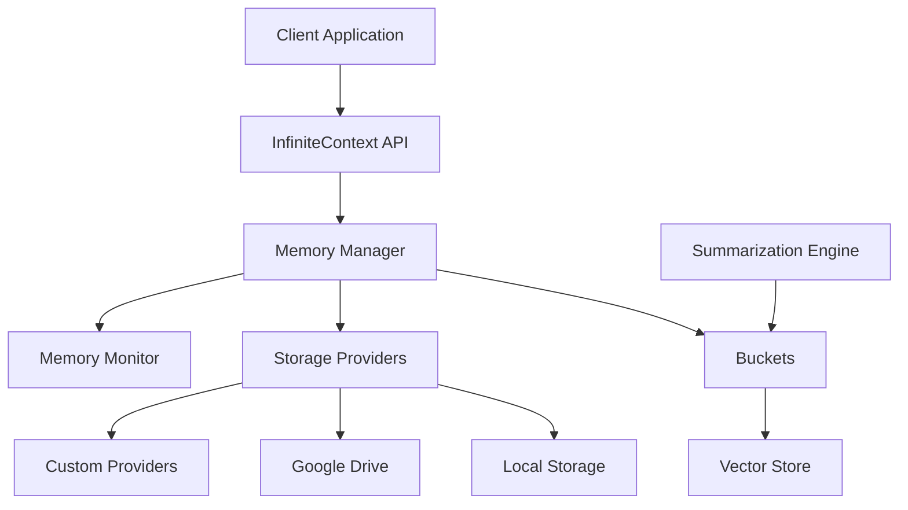

# InfiniteContext Architecture

This document provides a detailed overview of the InfiniteContext system architecture, explaining the core components, their interactions, and the design principles behind the system.

## System Overview

InfiniteContext is designed as a modular, extensible system for storing, organizing, and retrieving large amounts of contextual information across different storage tiers. The architecture follows a layered approach with clear separation of concerns:

## Core Components

### Memory Manager

The Memory Manager is the central coordinator of the system. It:

- Manages buckets and their hierarchical organization
- Coordinates storage providers and routes data between them
- Handles chunk creation, storage, and retrieval
- Monitors memory usage and generates alerts

The Memory Manager provides a high-level API for the rest of the system to interact with, abstracting away the complexity of the underlying components.

### Buckets

Buckets are the primary organizational units in InfiniteContext. They:

- Organize chunks by domain and topic
- Form hierarchical structures (buckets can contain sub-buckets)
- Provide efficient vector-based search capabilities
- Store metadata about the contained chunks

Each bucket is associated with a vector store that enables semantic search across its contents.

### Vector Store

The Vector Store is responsible for storing and retrieving vectors efficiently. It:

- Stores chunk embeddings and their associated metadata
- Provides nearest-neighbor search capabilities
- Supports different distance metrics (cosine, euclidean, dot product)
- Handles persistence of vectors to disk

The current implementation uses a simple in-memory approach, but it can be extended to use more sophisticated algorithms like HNSW (Hierarchical Navigable Small World) for larger datasets.

### Storage Providers

Storage Providers abstract away the details of different storage systems. They:

- Provide a unified interface for storing and retrieving data
- Handle authentication and connection to external services
- Manage quotas and report on storage usage
- Implement persistence strategies specific to each storage system

The system includes built-in providers for local filesystem and Google Drive, and can be extended with custom providers for other storage systems.

### Memory Monitor

The Memory Monitor tracks memory usage across the system and generates alerts when thresholds are exceeded. It:

- Monitors bucket sizes and growth rates
- Tracks storage provider capacities and usage
- Identifies rapidly growing domains
- Generates alerts for potential issues
- Provides detailed memory usage statistics

### Summarization Engine

The Summarization Engine generates summaries of text at different levels of abstraction. It:

- Creates multi-level summaries of chunks
- Extracts key concepts from text
- Identifies relationships between chunks
- Helps organize information hierarchically

## Data Flow

### Storing Content

1. Client calls `storeContent()` on the InfiniteContext API
2. InfiniteContext finds or creates the appropriate bucket
3. Memory Manager creates a chunk with embeddings and metadata
4. The chunk is added to the bucket's vector store
5. Memory Manager selects an appropriate storage provider
6. The chunk is serialized and stored in the provider
7. Memory Monitor updates its statistics and checks for alerts

### Retrieving Content

1. Client calls `retrieveContent()` with a query
2. InfiniteContext converts the query to a vector embedding
3. Memory Manager finds the most relevant buckets
4. Each bucket's vector store performs a similarity search
5. Results are combined, sorted, and filtered
6. The most relevant chunks are returned to the client

## Design Principles

### Modularity

The system is designed with clear separation of concerns, making it easy to replace or extend individual components without affecting the rest of the system.

### Extensibility

All major components have well-defined interfaces that can be implemented by custom extensions. This allows the system to be adapted to different use cases and environments.

### Scalability

The tiered storage architecture allows the system to scale from small, local deployments to large, distributed systems spanning multiple storage providers.

### Robustness

The system includes comprehensive error handling and fallback mechanisms to ensure reliability even when individual components fail.

### Observability

The Memory Monitor provides detailed insights into the system's operation, making it easy to identify and address potential issues.

## Implementation Details

### Vector Embeddings

The system uses vector embeddings to represent chunks of text in a high-dimensional space. These embeddings capture the semantic meaning of the text, enabling similarity-based search and retrieval.

By default, the system uses OpenAI's embedding models, but it can be configured to use any embedding function that produces compatible vectors.

### Storage Tiering

The system automatically routes data to the most appropriate storage tier based on availability and priority. This ensures efficient use of resources while maintaining performance.

Storage providers are organized into tiers:

- Tier 0: Memory (fastest, limited capacity)
- Tier 1: Local Storage (fast, moderate capacity)
- Tier 2: Cloud Storage (slower, high capacity)
- Tier 3: Platform Storage (specialized services)
- Tier 4: Extended Storage (additional capacity)

### Chunk Summarization

Each chunk can have multiple summaries at different levels of abstraction:

- Level 1: High-level summary (1-2 sentences)
- Level 2: Medium-level summary (paragraph)
- Level 3: Detailed summary (multiple paragraphs)

These summaries enable efficient browsing and organization of large amounts of information.

## Future Extensions

The architecture is designed to support several planned extensions:

1. **Distributed Operation**: Support for distributed deployment across multiple machines
2. **Advanced Indexing**: Integration with specialized vector databases for improved performance
3. **Streaming Updates**: Real-time updates and notifications for changes to the system
4. **Collaborative Features**: Support for multi-user access and collaboration
5. **Encryption**: End-to-end encryption for sensitive data
